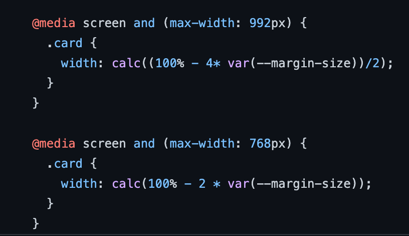

# mini-project-css-cheatsheet
Contains a CSS cheatsheet that works on desktop and mobile.

Calculation of card width % based on margin and screen size allows you to set a constant margin size (deployed at 10px). The cards will change size to accommodate a constant margin, taking up 100% of the main.

